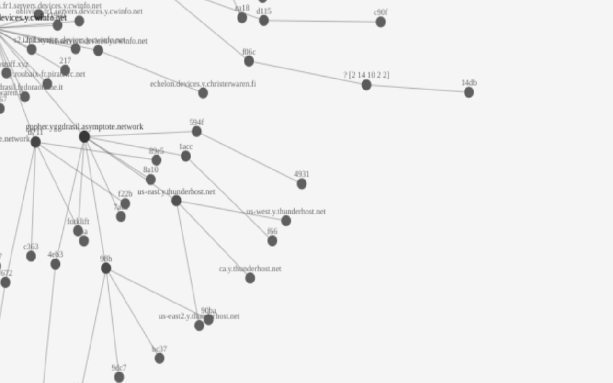

# yggdrasil-chromeos

> Proxy via `localhost:8080` if the domain can't be resolved or if the resolved IP is not in [Yggdrasils](https://yggdrasil-network.github.io/services.html) `0200::/7` network range.

🔖 **https://chrome.google.com/webstore/detail/yggdrasil-via-%60localhost8/hcgljgobhoaeojnhikfmnhdpmgbmflec**



## Usage

The Chrome Extension icon can be clicked. A standing `Y` indicates that forwarding to Tinyproxy is enabled.

While enabled Yggrasil IPs like `[21f:dd73:7cdb:773b:a924:7ec0:800b:221e]` and domains with Yggdrasil AAAA records like [y.thingylabs.io](http://y.thingylabs.io) will be proxied by the local Tinyproxy to the Yggdrasil network.

## Prerequisites

### Install Yggdrasil
Install Yggdrasil (see https://yggdrasil-network.github.io/installation-linux-deb.html):
```
# Add apt repository
# https://yggdrasil-network.github.io/installation-linux-deb.html
gpg --fetch-keys https://neilalexander.s3.eu-west-2.amazonaws.com/deb/key.txt
gpg --export 569130E8CA20FBC4CB3FDE555898470A764B32C9 | sudo apt-key add -
echo 'deb http://neilalexander.s3.eu-west-2.amazonaws.com/deb/ debian yggdrasil' | sudo tee /etc/apt/sources.list.d/yggdrasil.list

# Install Yggdrasil and its dependency
sudo apt update
sudo apt install -y yggdrasil dirmngr

sudo systemctl enable yggdrasil
sudo systemctl start yggdrasil
```
### Install a helper service
**Optional:** Install a restart script that tries to restart the Yggdrasil service every 4 seconds until the interface comes up and exits.

```
sudo cat << EOF | sudo tee -a /etc/systemd/system/start-yggdrasil.service
[Unit]
Description=Start yggdrasil when the tun device is added

[Service]
Type=simple
Restart=on-failure
RestartSec=4
ExecStart=/usr/local/bin/start-yggdrasil

[Install]
WantedBy=multi-user.target
EOF

sudo cat << EOF | sudo tee -a /usr/local/bin/start-yggdrasil
#!/bin/sh

if ! ip a show tun0 up
then
  service yggdrasil restart
  exit 1
fi

exit 0
EOF

sudo chmod +x /usr/local/bin/start-yggdrasil
sudo systemctl enable start-yggdrasil.service
```

### Prepare ChromeOS
**You have to redo this after every restart.**

- Press `CTRL + ALT + t` (while focusing a Chrome tab) and
- enter `vmc start termina` followed by
- `lxc config device add penguin tun unix-char path=/dev/net/tun`.

## Configure Yggdrasil
- Add peers https://github.com/yggdrasil-network/public-peers
- Make Yggdrasil reload: `sudo service yggdrasil reload`
- Verify it worked by looking at the active connections: `sudo yggdrasilctl getpeers`.

### Install Tinyproxy
- Install tinyproxy: `sudo apt install -y tinyproxy`
- Edit `/etc/tinyproxy/tinyproxy.conf` and set Port to `8080` (*Advised:* Set `Allow` to `127.0.0.1`).
- Reload Tinyproxy: `sudo service tinyproxy reload`

### Test

Copy the IPv6 and open it in Chrome: `[21f:dd73:7cdb:773b:a924:7ec0:800b:221e]` You should see an interactive map of nodes.
